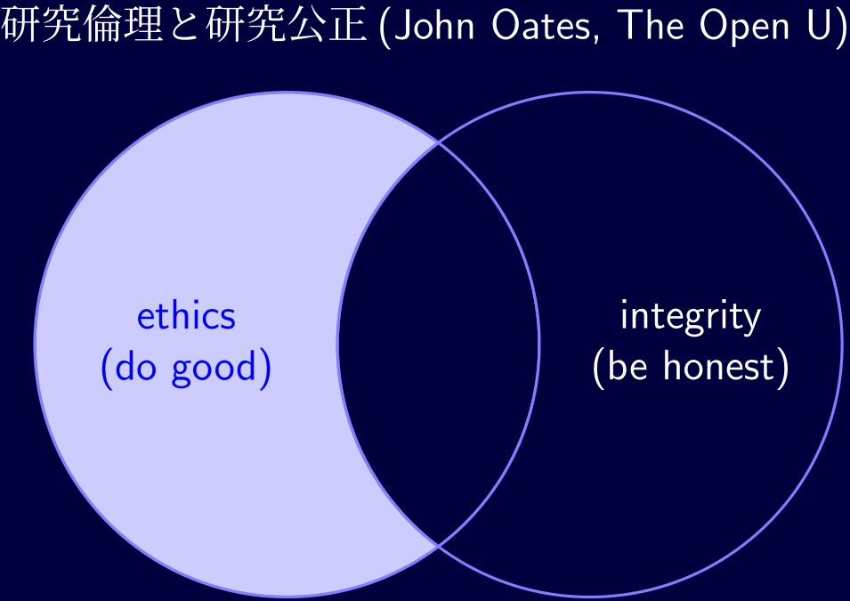

class: inverse
```{r xaringan setup, include=FALSE, warning=FALSE}
xaringanExtra::use_panelset()
library(xaringanthemer)
####style_mono_dark(base_color = "#cbf7ed")
####style_mono_light(base_color = "#23395b")
style_solarized_light(
  text_color = "black", 
  title_slide_background_color = "darkblue",
  link_color = "green")
#### xaringancolor setup
library(xaringancolor)
xaringancolor::setup_colors(
  red ="red",
  green = "green",
  blue = "blue"
)
library(RefManageR)
```
```{r xaringan bib, include=FALSE, cache=T}
#### bibliography setup
BibOptions(check.entries = FALSE, style = "markdown", cite.style = "authoryear",
  bib.style = "authoryear", dashed = T, hyperlink = "to.doc")
##### (old) Uncomment below for the 1st run of each R session. 2nd run will get cached results.
##### (new) Delete cache if you add an entry to seiro.bib.
myBib <- ReadBib("c:/seiro/settings/TeX/seiro.bib")
```
<div style = "position:fixed; visibility: hidden">
$$\require{color}\definecolor{red}{rgb}{1, 0, 0}$$
$$\require{color}\definecolor{green}{rgb}{0, 1, 0}$$
$$\require{color}\definecolor{blue}{rgb}{0, 0, 1}$$
</div>
<script type="text/x-mathjax-config">
MathJax.Hub.Config({
  TeX: {
    Macros: {
      red: ["{\\color{red}{#1}}", 1],
      green: ["{\\color{green}{#1}}", 1],
      blue: ["{\\color{blue}{#1}}", 1]
    },
    loader: {load: ['[tex]/color']},
    tex: {packages: {'[+]': ['color']}}
  }
});
</script>
<style>
.red {color: #FF0000;}
.green {color: #00FF00;}
.blue {color: #0000FF;}
</style>
```{r flair_color, echo=FALSE}
library(flair)
red <- "#FF0000"
green <- "#00FF00"
blue <- "#0000FF"
```
```{css echo=FALSE}
.highlight-last-item > ul > li,
.highlight-last-item > ol > li {
  opacity: 0.5;
}
.highlight-last-item > ul > li:last-of-type,
.highlight-last-item > ol > li:last-of-type {
  opacity: 1;
}
.inverse {
  background-color: #272822;
  color: #d6d6d6;
  text-shadow: 0 0 20px #333;
}
mark.red {
    color:#ff0000;
    background: none;
}
mark.blue {
    color:#0000A0;
    background: none;
}
.my-style {
  font-weight: bold;
  font-style: italic;
  font-size: 1.5em;
  color: red;
}
blockquote {
  border-left: .2px solid #275d38;
  margin: -5px 80px -5px 20px;
  padding-top: -0.5px;
  padding-bottom: -0.5px;
  line-height: 1.35em;
}
.pull-left60 {
  float: left;
  width: 57%;
  padding-right: 2px
  margin-top: -1em;
  margin-bottom: 0em;
}
.pull-right40 {
  float: right;
  width: 37%;
  padding-left: 2px
  margin-top: -1em;
  margin-bottom: 0em;
}
.pull-left70 {
  float: left;
  width: 67%;
  padding-right: 2px
  margin-top: -1em;
  margin-bottom: 0em;
}
.pull-right30 {
  float: right;
  width: 27%;
  padding-left: 2px
  margin-top: -1em;
  margin-bottom: 0em;
}
.pull-left50 {
  float: left;
  width: 50%;
  padding-right: 0px;
  padding-left: 0px;
  margin-top: -2em;
  margin-bottom: -1em;
}
.pull-right50 {
  float: right;
  width: 50%;
  padding-right: 0px;
  padding-left: 0px;
  margin-top: -2em;
  margin-bottom: -1em;
}
.center2 {
  margin: 0;
  position: absolute;
  top: 50%;
  left: 50%;
  -ms-transform: translate(-50%, -50%);
  transform: translate(-50%, -50%);
}
```

<script type="text/x-mathjax-config">
MathJax.Hub.Config({
  TeX: {
    Macros: {
      E: "{\\Large\\varepsilon}",
      bfx: "{\\mathbf{x}}",
      bfX: "{\\mathbf{X}}",
      bfalpha: "{\\boldsymbol{\\alpha}}",
      bfbeta: "{\\boldsymbol{\\beta}}",
      st: "{\\mbox{s.t.}}"
    }
  }
});
</script>
Any japanese?
---
class: inverse, middle, center
# 研究倫理

## 2024年度新入職員研修

<br>
### 開発研究センター 伊藤成朗
### `r format(Sys.time(), '%Y年%m月%d日 %R')`
---
class: inverse, middle, center

Any japanese?
---
class: inverse, middle, center
## 研究コミュニティに身を置く者が持つべき心構えをお話します。
---
class: inverse


極言すると  


.pull-left70[
研究倫理とは  

研究で対象社会に迷惑を与えないという原則

研究公正とは  
研究でごまかしをしないという原則
]

.pull-right30[
最低限の原則  

それでも足をすくわれる研究者はいる
]
<br>
どう判断すれば分からなくなったとき、大原則に戻ると考えやすくなる  

--

研究は社会と契約を結んで実施している  

--

社会から託された信任を裏切ってはいけない  

`r Citet(myBib, "GNR2020")`
---



---
class: center
name: 
background-image: url("REAndRI.jpg")
background-size: 100%

---

> the conditions which a value added production function can straightforwardly be derived from a more primitive gross output production function are quite restrictive.  

<p style="margin-bottom:2cm;">.pull-left[] .pull-right[`r Citet(myBib, "DeLoeckerSyverson2021", after = ", 5.6.2")`]</p>

---
class: inverse
```{r bib, include=FALSE}
#### create a bib file for the R packages used in this document
knitr::write_bib(x = "rmarkdown", file = 'KenkyuuRinri.bib')
```
```{r results = "asis", echo = FALSE}
PrintBibliography(myBib, .opts = list(check.entries = F, sorting = "nyt",
  no.print.fields=c("eprint", "URL")),
  start = 1, end = 8)
```
---
class: inverse
```{css, eval = F, echo = F}
.remark-slide-content {
  font-size:          12px;
  line-height:        1.2em;
}
```
```{r results = "asis", echo = FALSE, warning = F}
PrintBibliography(myBib, .opts = list(check.entries = FALSE, sorting = "nyt",
  no.print.fields=c("eprint", "URL")),
  start = 9, end = 12)
```
